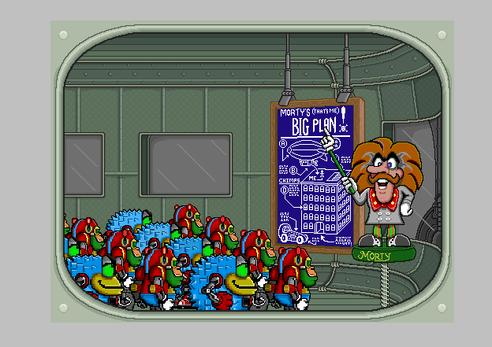
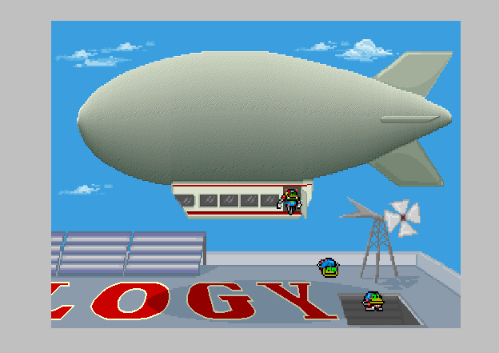
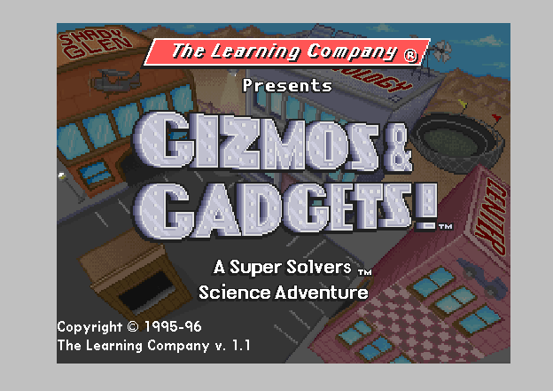
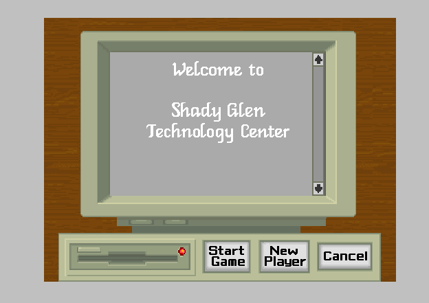
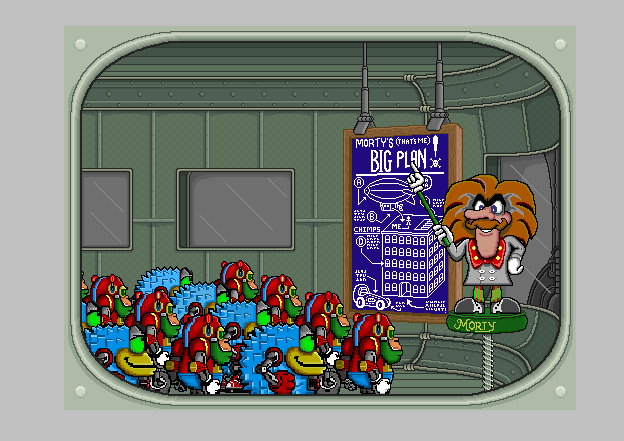

# Super Solvers, recompiled

Static recompilation of The Learning Company's Win32 **Super Solvers** games
from their shipping binaries to native C. No emulator: the 1996 machine code,
translated once and compiled for a machine that did not exist when it shipped.

These games are the same program wearing different art — Borland C++ PE32 built
for Win32s, drawing through WinG, settings in an `.INI` beside the executable,
assets read off the CD by hand — so they share one engine layer here, and a fix
found in one is a fix in all of them.

Built on the [pcrecomp](https://github.com/sp00nznet/pcrecomp) toolchain,
alongside [operationneptune](https://github.com/sp00nznet/operationneptune),
which is the same engine again and where most of this runtime started.

## The titles

| | Binary | Status |
|---|---|---|
| **Gizmos & Gadgets!** (1993 / CD 1996) | `SSGWIN32.EXE`, 284 KB code | **Plays its whole attract sequence** — the intro, animated, with music and speech; the title card; sign-in, with working buttons |
| **Treasure MathStorm!** (1992 / CD 1996) | `TMS32.EXE`, 290 KB code | **Boots and runs** — loads its archives, creates both WinG surfaces, finds its music. Nothing on screen yet |



*Gizmos & Gadgets' opening scene, drawn by the game's own code running natively.
The robots and Morty's arm animate; the blackboard, the lab and every sprite
come out of the game's `.DAT` archives through its own RLE decoder.*

| | |
|---|---|
|  |  |
| Later in the same cutscene: the airship over the Technology Center roof | The title card, after the intro plays out |
|  |  |
| Shady Glen Technology Center: Start Game, New Player, Cancel | The same lab a few seconds on — the robots and Morty's arm have moved |

### Gizmos & Gadgets

Working: the intro end to end with its MIDI score and its speech; graphics at
512×384 in 256 colours, both WinG pages, the RLE sprite codec, the palette, and
real GDI text in the same pixels; mouse and keyboard into the game's own window
procedure; all 154 imports bridged.

Not working yet: **no game has been played.** The attract loop runs, but nobody
has signed in and gone into the lab, so the puzzles, the vehicle workshop and the
races are all unvisited. Almost nothing is named either — all 1,998 functions are
`sub_004xxxxx`, and unlike Neptune this disc ships no linker map.

### Treasure MathStorm

Working: startup, `TMSDATA.DAT` and `TMSSOUND.DAT`, both 640×480 WinG surfaces,
its music files, and **all 158 imports bridged** on the first run that got that
far.

Not working yet: nothing has reached the screen. Its audio is Miles rather than
waveOut and MCI, and its cutscenes are Smacker video; both are shimmed rather
than implemented — `AIL_*` is bookkeeping with no mixer behind it, and
`SmackOpen` declines, which is what the game sees when the disc is not in the
drive. That is where the next work is.

### The lift

| | Gizmos & Gadgets | Treasure MathStorm |
|---|---:|---:|
| Functions recovered | 1,998 | 4,769 |
| Instructions decoded | 121,459 | 314,026 |
| Code bytes covered | **99.07%** | **99.98%** |
| Lines of generated C | 241,909 | 628,392 |
| Lift errors | 0 | 0 |
| Imports bridged | **154 of 154** | **158 of 158** |

MathStorm's function count is inflated and its line count with it: recursive
descent over-merges badly on that binary, and several of its "functions" span
most of the code section, so the same instructions get lifted into more than one
of them. It compiles and runs; it is about three times the C it should be.

### Not this engine

Three more Super Solvers titles sit on the same Win3x disc set and are **16-bit
NE**, not Win32 — a different pipeline entirely (pcrecomp's `ne/` and `lift16`,
as used for Catz, Microsoft Bob and El-Fish):

Midnight Rescue! (22 segments), OutNumbered! (26) and Spellbound! (21). Each
imports only GDI, KERNEL, MMSYSTEM, TOOLHELP and USER, and none has a 32-bit twin
on its disc. Treasure Mountain! and Treasure Galaxy! ship no CD image at all.

## The engine underneath

Operation Neptune, Gizmos & Gadgets and Treasure MathStorm are the same program
wearing different art. All three are Borland C++ PE32 builds for Win32s, all
three draw through **WING32.DLL**, all three keep their settings in an `.INI`
next to the executable, and all three read their assets out of flat archives on
the CD by hand.

That is the whole point of doing them in order. Neptune took a full engine-layer
bring-up; Gizmos & Gadgets reused it, and the work reduced to the differences
below. MathStorm then reused *that* and was answering all 158 of its imports on
the first run — its differences are Miles instead of waveOut and MCI, Smacker
cutscenes, and WinG linked statically rather than loaded by hand.

Gizmos & Gadgets against Neptune:

| | Operation Neptune | Gizmos & Gadgets |
|---|---|---|
| Binary | `ONWIN32.EXE`, 176 KB code | `SSGWIN32.EXE`, 284 KB code |
| Imports | 139 | 154 |
| Assets | six 16-bit NE resource DLLs | 21 flat `.DAT` archives |
| WinG | resolved **by name** | resolved **by ordinal** |
| WinG surfaces | one, 640x800 (two pages in one) | **two**, 512x384 each |
| WinG orientation | top-down | **bottom-up** |
| Linker map on the disc | yes, `ONWIN.MAP` | no |
| Sound refusal | `CheckSound` INI switch | hardcoded `MIDIMAP.CFG` probe |

43 imports are new here and 28 of Neptune's are unused. The rest of the work
was five things.

### WinG, by ordinal

There is not one `WinG*` string anywhere in `SSGWIN32.EXE`. It resolves all
eight entry points by **ordinal**, and `GetProcAddress` with an ordinal passes
an integer where a string pointer goes — so dereferencing it faulted on the
very first call, asking for ordinal 3.

The ordinals are WinG 1.0's own, read off the `WING32.DLL` that ships in the
game's own `Apps\wing` redistributable. They are alphabetical, which is why
`WinGBitBlt` is 1 and `WinGCreateDC` is 3.

### Two WinG surfaces, not one

Neptune asked WinG for a single 640x800 buffer and flipped pages by blitting
from a different `y`. This game asks for two 512x384 bitmaps and keeps both
pointers, so the shim had to stop being a single global: each bitmap now gets
its own section, its own DIB section and its own 4 MB of low address space, and
`WinGGetDIBPointer` resolves which one by asking GDI what is selected into the
DC it was handed.

### Which way up, and who adds the offset

`WinGRecommendDIBFormat` does not just describe a bitmap: the caller reads the
sign of `biHeight` and *installs a different blitter*. Recommend top-down and
this game still chose its bottom-up set -- stride -512, row address
`base + (383 - y) * 512`, stepping `sub edi, 0x200` per row -- so it drew upside
down through a top-down DIB and the picture came out as a sheared wedge.
Bottom-up is also what real WinG answered on the 8bpp displays this shipped for.

Then, having got that right, the picture went perfectly black. Neptune's shim
returned the *topmost scanline* from `WinGGetDIBPointer`, which for a bottom-up
surface is the far end of the buffer. Neptune only ever asked for top-down
surfaces, so that branch had never run. This game's row helper computes
`base + (383 - y) * 512` for itself, so a base with `(h-1) * stride` already
added put every row a whole screen past the picture -- landing in the slack,
faulting nothing, drawing nothing, and leaving a perfectly black 512x384
rectangle with a fully populated palette. Real WinG returns the start of the
pixel data, both ways round, because it is just what `CreateDIBSection` gave it.

### The sprite blitter draws off the bottom of the screen

`sub_0040280E` clips the starting `y` against the clip rectangle on entry and
then never checks it again — the row loop runs the sprite's full height. Start a
200-row sprite at y=380 on a 384-row surface and it writes 196 rows past the
end. In 1996 those rows landed on somebody else's heap and nobody noticed.
Against a mapping of exactly the right size it is an access violation on the
first frame.

So each WinG surface carries a whole extra surface of slack at each end, which
is that worst case by construction rather than a round number.

### The MIDI driver check from 1996

The game builds `<windir>\system\midimap.cfg`, `_lopen`s it, and if that fails
tries `\system32\` too. `MIDIMAP.CFG` is the Windows 3.1 MIDI mapper
configuration and no Windows has shipped it in thirty years, so both fail, and
the game puts up dialog 3041 — *"The MIDI driver for your sound card could not
be found"* — whose only button is **Exit**.

The question it is really asking already got a yes: `midiOutGetNumDevs` and
`midiOutGetDevCapsA` run immediately before and pass straight through to a host
that has a synth. Only the file is missing, and the game never reads a byte of
it. So the probe is answered with `NUL` — a file that is always there and has
nothing in it, which is exactly what is true.

### Dialogs, for real

Neptune never needed `DialogBoxParamA`. This game will not start without one,
and with the stub returning -1 it destroyed its window and exited — that was as
far as the first run got.

Both halves turned out to be tricks the bridge already knew. The **template** is
a resource, and resources come out of the image we mapped rather than the host
module, which the resource walker already did for `LoadStringA`; a `DLGTEMPLATE`
is version-independent bytes sitting at a real address, so
`DialogBoxIndirectParamA` takes it as it stands. The **procedure** is a VA in
lifted code with no machine code behind it, so it goes through a trampoline,
exactly like the window procedure.

## Seven bugs these games found in the toolchain

These are Borland builds whose drawing code is ported 16-bit assembly, so they
lean on parts of the lifter that a 32-bit MSVC game never touches. All seven are
fixed upstream in [pcrecomp](https://github.com/sp00nznet/pcrecomp), with
regression cases in its differential harness, and every project there gets them.

Five of the seven are the same defect wearing different clothes: **an
instruction writes CF, and the lazy flag model is not told.** The model holds
one instruction's operands and a kind, and derives each flag when something
asks — which works for arithmetic and fails for everything whose result is a
carry rather than a number. Each time it surfaced it looked like a different
bug, and each time the fix was to freeze the flags into a word with the real
carry in it.

**`loop` was not a branch.** `disasm32.py` derived block leaders from its
conditional-jump set, and `loop`/`loope`/`loopne` were not in it. The jump was
not lost -- the *label* was, so a `loop` back into the middle of its own block
compiled to a `goto` with nothing to go to. Two functions failed to compile,
which is the lucky version of this bug.

**Rotates were 32-bit and silent.** `rol`/`ror`/`rcl`/`rcr` were lifted as
32-bit regardless of operand width, so `rcr cl,1` fed the carry in at bit 31
where the write back to `CL` then dropped it. And they published no flags at
all: a rotate writes CF, but the lazy flag triple still held the *previous*
instruction's operands, so a following `jae` read that instruction's carry.
The RLE sprite decoder says `sub bx,cx; rcr cl,1; rep movsw; jae` -- the `jae`
asking *"was the count odd?"* -- and answering it with the subtract's borrow ran
the decoder off the end of both the sprite and the framebuffer.

**16-bit `push`/`pop` were lifted as 32-bit.** `push bp` / `pop bp` move `esp`
by two, and the pop writes `BP` only. Lifting them as their 32-bit cousins
balances the stack, so it looks fine -- and then the pop replaces the whole of
`ebp` with a zero-extended word. `leave` handed the truncated value to `esp`,
and the next stack access was down at 64 KB.

**Every flag off a narrow operand was derived at 32 bits.** The flag tuple holds
two values and a kind, but no width: `add ax,cx` with `ax=0xFFFF` and `cx=2`
wraps at 16 bits and sets CF, and the same two numbers at 32 bits do not. In a
program whose inner loops count in `bx` and `cx`, that is most of the compares
in it. Narrow operands are now stored **left-aligned** -- shifted up so the
value's own top bit lands on bit 31 -- which makes CF, ZF, SF and OF come out
right through the existing 32-bit macros, at no runtime cost and with no change
at the hundreds of sites that pair a jcc with its setter statically.

**A shift's carry never reached its consumer.** `shl`/`shr`/`sar` recorded their
flags as a logic op, whose carry is zero, so `CMP_AE(result, result)` -- `r >= r`
-- was *always true*. The background blitter is
`shr ecx,1; rep movsw; jae skip; movsb`: copy width/2 words, then the odd byte.
With that `jae` always taken, every row of every background lost its last byte
and the picture came out as a diagonal smear. Shifts now freeze their flags into
an EFLAGS word carrying the real carry, which also retired a divergence the
harness had been carrying about shifts by zero.

**`rep stosw` was not implemented.** `stosw` and `lodsw` were simply missing from
the lifter's string-operation set, so they fell through to `UNIMPLEMENTED` and
emitted nothing -- not even the pointer advance. `rep stosw` is how a run-length
codec writes a run of one colour, which is most of a 1990s background image, so
every fill wrote no pixels and left `edi` where it was, desynchronising the rest
of the row. This was the last bug between a black screen and the picture above.

**`clc` and `stc` wrote a carry nobody read.** They set the running carry
variable and left the flag tuple pointing at the last arithmetic instruction, so
the branch that reads the carry read *that* instead. Borland's `strcpy` and
`strcat` are one routine with two entry points — `clc` at one, `stc` at the
other, and a single `jb` deciding whether to scan for the end of the destination
first. With the carry unpublished, `strcpy` ran as `strcat`: Treasure MathStorm
built every data file's path onto the end of the previous one and could open
none of them. (`cmc` was wrong twice over — it complemented the running variable
rather than the carry that was actually set.)

### And two in this project's own test harness

Both cost real debugging time, so they are worth writing down. The game
**relaunches itself** to claim 0x400000 (see `premap.c`), so stopping the
process handle the script holds leaves the *child* running -- which owns the
window, so the next run's `FindWindowA` single-instance check found it and the
game exited before drawing. That reads as "the build broke", and it was not.

And `PrintWindow` photographs nothing here: the game takes a DC once a frame and
blits its dirty rectangles straight to it, outside `WM_PAINT` entirely, so asked
to print itself it fills the background and returns. Every shot came back flat
grey while the real window was showing the game. Grabbing the screen instead
needs the window on top, and `SetForegroundWindow` from a background script does
not get it there -- the first attempt that way photographed the terminal that
launched it. Reading the window's own DC works, occluded or not.

## Building it

You need your own copy of each game. Put a disc's contents under
`titles/<title>/original/`, so that the path in that title's `title.json`
resolves — `titles/gizmos/original/SSGWINCD/SSGWIN32.EXE`,
`titles/mathstorm/original/TMS32.EXE`.

```powershell
# Lift a binary to C (a minute or two)
python scripts\run_pipeline.py gizmos --all

# Build it. The engine compiles alongside that title's lifted code.
scripts\build.ps1 gizmos

# Run it
titles\gizmos\work\gizmos.exe titles\gizmos\original\SSGWINCD\SSGWIN32.EXE

# Or drive it and photograph it, muted
scripts\shot.ps1 gizmos -At 20,140,165
scripts\shot.ps1 gizmos -Clicks "150@415,372"
scripts\shot.ps1 mathstorm -Loud
```

`scripts\run_pipeline.py` expects the pcrecomp checkout as a sibling directory
(`../tools`).

### Adding a title

A directory under `titles/` with a `title.json` naming the executable, and that
game's `original/` beside it. Nothing in `engine/` or `scripts/` needs editing:
the bridge table is a superset and binds whichever imports the binary in front of
it actually has, so a new game costs a manifest plus whatever it turns out to
need that nothing before it did.

### Knobs

| Variable | What |
|---|---|
| `GG_SCREEN=w,h` | What the game is told the screen is. Default `640,480`; `0,0` passes the real desktop through. |
| `GG_VOLUME=0..100` | This process's own audio session. `0` mutes. Leaves the system master alone. |
| `GG_TOPDOWN=1` | Recommend a top-down DIB, which puts the game on its other blitter. Bottom-up is the default and the right one. |
| `GG_QUIET_BRIDGES=1` | Stop logging every bridged call. |
| `GG_QUIET_FILES=1` | Stop logging every file the game opens. |
| `GG_NO_DIALOGS=1` | Answer message boxes with OK instead of blocking. |
| `GG_WATCHDOG_MS=n` | Dump the trace and bail if nothing has happened for `n` ms. |

## Layout

```
engine/           the shared runtime: memory model, IAT bridges, WinG, audio
scripts/          run_pipeline.py, build.ps1, shot.ps1 -- each takes a title
titles/<title>/
  title.json      which binary, and what the game is called
  original/       your copy of that disc (not in this repo)
  gen/            generated C (not in this repo -- regenerate it)
  work/           scratch: the built exe, logs, screenshots
docs/
```

## License

**MIT** — see [LICENSE](LICENSE).

One thing the licence cannot give you: rights to the software you point this
at. Lifting a binary produces a derivative work of that binary, so the output
carries whatever licence the original does. Gizmos & Gadgets is © 1993-1996 The
Learning Company, long out of print, and the copyright most likely still
subsists somewhere down the TLC → SoftKey → Mattel → Riverdeep → HMH chain.
Bring your own disc.
